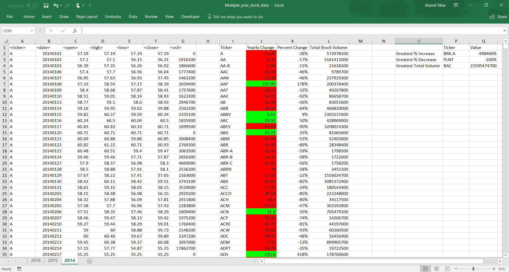
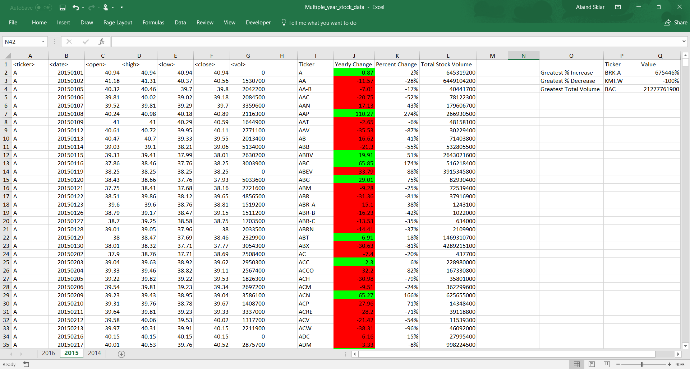
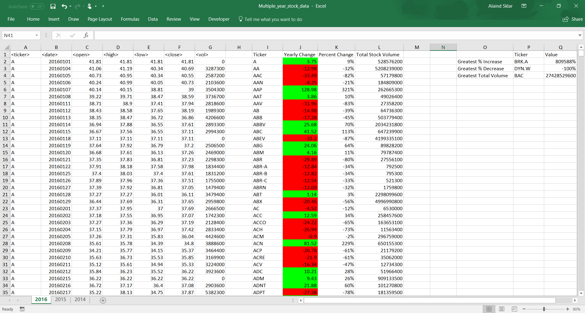

# Multi-Year Stock Data

In this project, I was tasked to use VBA scripting to analyze stock market data from 2014 to 2016.  By using VBA, I was able to loop through multiple Excel worksheets and calculated the yearly changes of the stocks' opening and closing prices, the stocks' yearly percent changes, and the stocks' total volume.  In addition, I calculated which stock had the greatest percent increase, the greatest percent decrease, and the great total volume.

